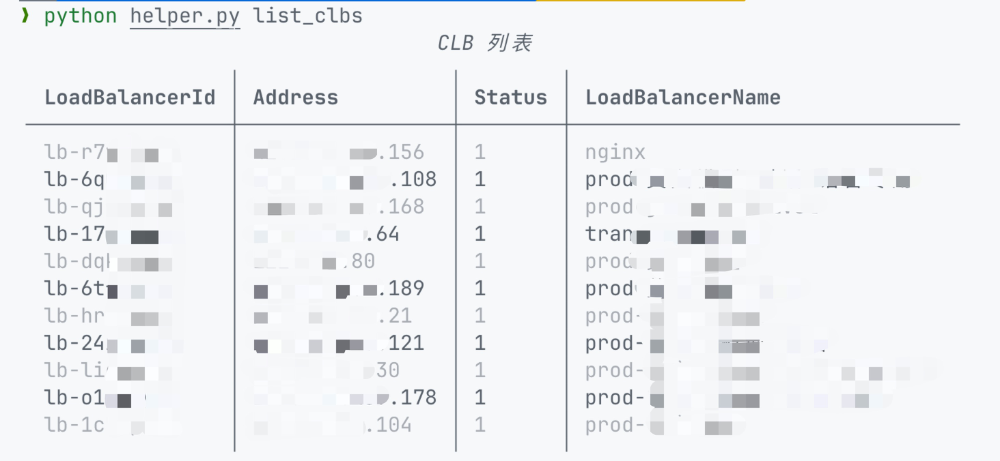
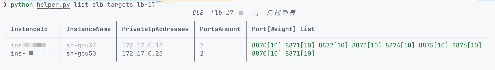
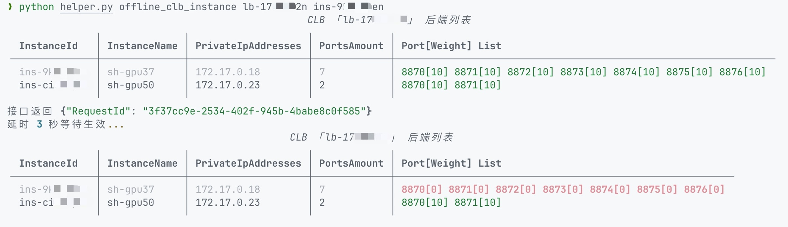
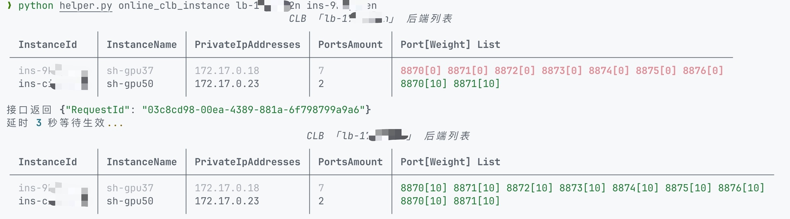

# tencentcloud-clb-helper

[](https://github.com/mrchi/tencentcloud-clb-helper/actions/workflows/linting.yaml)
[](https://github.com/mrchi/tencentcloud-clb-helper/actions/workflows/unittest.yaml)

腾讯云 CLB 后端**按节点**批量上下线辅助工具。

## 准备环境

需要 Python >= 3.7。

安装依赖

```bash
# by pip
pip install -r requirements-deploy.txt

# by pipenv
pipenv install
```

## 准备配置

配置文件内容格式参考文件 `tc-clb-helper.json.example`。其中：

- `secret_id` 和 `secret_key` 为必填，在腾讯云控制台生成，传送门 [访问密钥 \- 控制台](https://console.cloud.tencent.com/cam/capi)
- `region` 和 `endpoint` 为选填，一般情况下保持默认即可。


配置文件路径按读取优先级从高到低为：

- 工具脚本同级目录下的 `tc-clb-helper.json`；
- XDG 目录（用户主目录下 `.config` 目录）下的 `tc-clb-helper.json`；

## 脚本说明

```
> python3 helper.py --help

NAME
    helper.py

SYNOPSIS
    helper.py COMMAND

COMMANDS
    COMMAND is one of the following:

     list_clb_targets
       按节点展示 CLB 后端列表

     list_clbs
       展示 CLB 列表

     offline_clb_instance
       按节点批量下线 CLB 后端端口

     online_clb_instance
       按节点批量上线 CLB 后端端口
```

共有 4 个命令：

- `list_clbs` 展示 CLB 列表；
- `list_clb_targets` 按节点展示 CLB 后端列表；
- `offline_clb_instance` 按节点批量下线 CLB 后端端口；
- `online_clb_instance` 按节点批量上线 CLB 后端端口；

### list_clbs

```
NAME
    helper.py list_clbs - 展示 CLB 列表

SYNOPSIS
    helper.py list_clbs -

DESCRIPTION
    展示 CLB 列表
```




### list_clb_targets

```
NAME
    helper.py list_clb_targets - 按节点展示 CLB 后端列表

SYNOPSIS
    helper.py list_clb_targets CLB_ID

DESCRIPTION
    按节点展示 CLB 后端列表

POSITIONAL ARGUMENTS
    CLB_ID
        Type: str

NOTES
    You can also use flags syntax for POSITIONAL ARGUMENTS
```




### offline_clb_instance

```
NAME
    helper.py offline_clb_instance - 按节点批量下线 CLB 后端端口

SYNOPSIS
    helper.py offline_clb_instance CLB_ID INSTANCE_ID

DESCRIPTION
    按节点批量下线 CLB 后端端口

POSITIONAL ARGUMENTS
    CLB_ID
        Type: str
    INSTANCE_ID
        Type: str

NOTES
    You can also use flags syntax for POSITIONAL ARGUMENTS
```



### online_clb_instance

```
NAME
    helper.py online_clb_instance - 按节点批量上线 CLB 后端端口

SYNOPSIS
    helper.py online_clb_instance CLB_ID INSTANCE_ID

DESCRIPTION
    按节点批量上线 CLB 后端端口

POSITIONAL ARGUMENTS
    CLB_ID
        Type: str
    INSTANCE_ID
        Type: str

NOTES
    You can also use flags syntax for POSITIONAL ARGUMENTS
```


